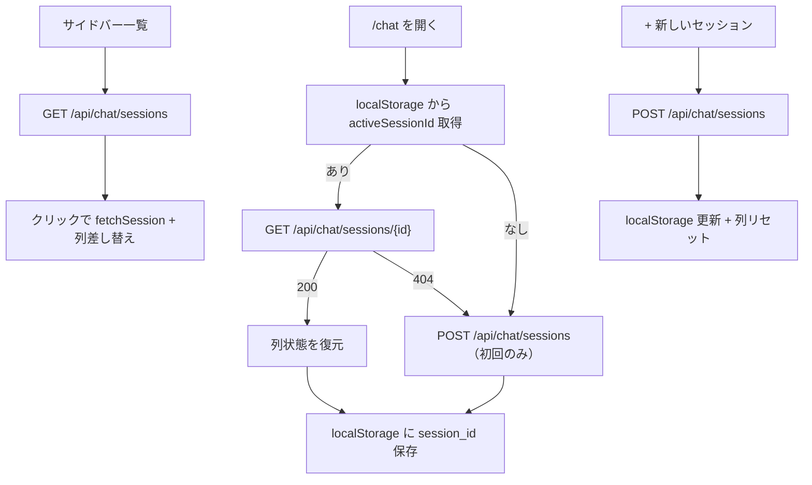

# インタラクティブチャット UI

ダッシュボード `/chat` から、蒸留ジョブ非実行時に styles.yaml の全スタイルで並列対話し、
やり取りを `data/distilled/responses.jsonl` に `category="人間との対話"` として追記する機能。

## 起動

```bash
uv run joryu-up --detach
# ブラウザ: http://localhost:3000/chat
```

API は `http://localhost:8000/api/chat`（dashboard 経由は `/api/chat` プロキシ）。

## セッション管理

セッションの分離は **UI 上で「+ 新しいセッション」を押した時のみ** 行う。ページ再訪問やリロードでは自動的に新規セッションは作られない。

### 復元フロー



- **localStorage キー**: `joryu.chat.activeSessionId`
- **永続化先（サーバー）**: `data/chat/sessions.db`（SQLite）
- **TTL**: なし（明示 DELETE のみ）。再起動後もセッションは残る。

### サイドバー

- 過去セッション一覧（`title` / 最終更新 / ターン数）
- クリックで切替
- 「+ 新しいセッション」で明示的に新規作成
- 各行から改名（PATCH）・削除（DELETE）可能

## 操作フロー

1. 初回訪問時のみ空セッションが 1 件作成される。以降はリロードで直前のセッションが復元される。
2. styles.yaml の列（prose / qa_short / dialog / report）が横並びで表示される。
3. **初回**: 画面下の単一 textarea から同一 prompt を全列へ並列送信。
4. **2 ターン目以降**: 各列の下部 textarea から、そのスタイルにだけ追加質問可能（履歴も列ごとに独立）。
5. ジョブ（蒸留 / 高品質抽出）が queued/running の間は送信不可（黄色バナー表示）。

## API エンドポイント

| Method | Path | 用途 |
|--------|------|------|
| GET | `/api/chat/styles` | スタイル一覧 |
| GET | `/api/chat/sessions` | セッション一覧（`limit`, `cursor`） |
| POST | `/api/chat/sessions` | セッション作成 |
| GET | `/api/chat/sessions/{id}` | 履歴取得 |
| PATCH | `/api/chat/sessions/{id}` | タイトル改名 `{ "title": "..." }` |
| DELETE | `/api/chat/sessions/{id}` | セッション破棄 |
| POST | `/api/chat/sessions/{id}/messages` | 初回: 全列並列 SSE |
| POST | `/api/chat/sessions/{id}/columns/{style_id}/messages` | 2 ターン目以降: 単列 SSE |

### 一覧 API レスポンス

```json
{
  "items": [
    {
      "session_id": "uuid",
      "title": "先頭30文字...",
      "created_at": 1719500000.0,
      "last_updated_at": 1719500100.0,
      "turn_count": 2
    }
  ],
  "next_cursor": "1719500000.0:uuid"
}
```

- 並び順: `last_updated_at` 降順
- `title`: 初回プロンプト先頭 30 文字（未送信時は null）
- `turn_count`: 全列の `turn_index` 最大値

## SSE イベント

| event | data フィールド |
|-------|----------------|
| `token` | `column`, `delta` |
| `tool_call` | `column`, `call_id`, `name`, `arguments` |
| `tool_result` | `column`, `call_id`, `content` |
| `column_done` | `column`, `finish_reason`, `record_id` |
| `done` | `session_id` |
| `error` | `column?`, `message` |

error 発生時も `column_done` → `done` でストリームが必ず終了する (Issue #182 修正)。

## ツール

| ツール | 実装 | 環境変数 |
|--------|------|----------|
| `search` | Tavily AI Search (未設定時 stub) | `TAVILY_API_KEY`, `JORYU_SEARCH_PROVIDER` |
| `weather` | Open-Meteo (キー不要) | `JORYU_WEATHER_PROVIDER` |
| `fetch_url` | httpx + BeautifulSoup (SSRF 対策) | `JORYU_FETCH_*` |
| `calc` | ローカル AST 評価 | — |

セッション作成時に Asia/Tokyo の今日の日付が system prompt へ注入される。

## MCP サーバー

``config.yaml`` の ``mcp.enabled: true`` かつ ``url`` 設定時、``uv run joryu-up`` が
``mcp`` コンテナ (``joryu-mcp --http``) も起動する。compose 内 URL は ``http://mcp:8200``。

```bash
uv run joryu-mcp --stdio
uv run joryu-mcp --http --port 8200
```

提供ツール: `today_jst`, `web_search`, `weather`, `fetch_url`。
`config.yaml` の `mcp.enabled: true` で API が `McpToolExecutor` 経由で利用可能 (既定 false)。

## JSONL スキーマ拡張

既存 distill レコードに加え、チャット経由の行には次が付与される:

- `category`: 固定 `"人間との対話"`
- `session_id`: チャットセッション UUID
- `turn_index`: 列ごとのターン番号（0 起算）

蓄積確認: `/outputs?category=人間との対話`

セッション SQLite と JSONL は独立。JSONL はターン完了ごとに追記され、セッション状態（messages / turn_index）は SQLite が保持する。

## ジョブ排他

GPU 衝突回避のため、`JobRunner.running_id` がセットされている、または
ジョブストアに queued/running ジョブがある場合、送信系 API は **409** `{ "error": "job_active" }` を返す。

## 実装モジュール

- `src/joryu/chat/session.py` — SQLite セッションストア
- `src/joryu/chat/session_db.py` — DB 永続化
- `src/joryu/chat/streamer.py` — tool loop + 擬似トークン SSE
- `src/joryu/chat/persistence.py` — `build_chat_record()`
- `dashboard/src/app/chat/page.tsx` — UI
- `dashboard/src/components/ChatSessionSidebar.tsx` — セッション一覧
- `dashboard/src/lib/chat.ts` — API / SSE クライアント
- `dashboard/src/lib/chatSessionStorage.ts` — localStorage 復元
